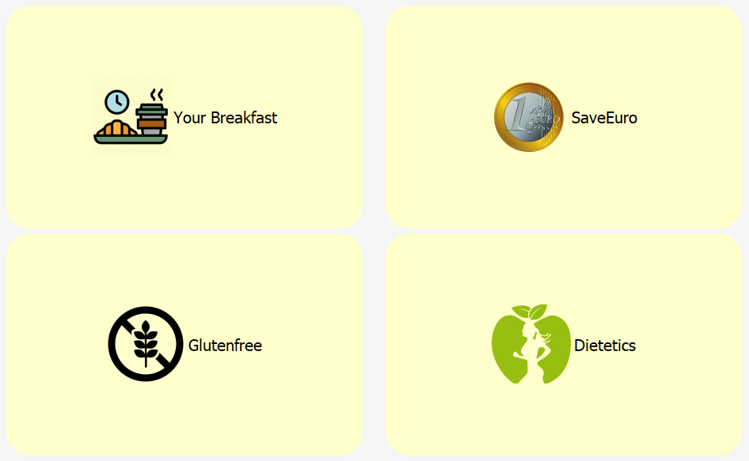

#  *Fast Food Portal*

1. [Project purpose](#project-purpose)
2. [Features implemented](#features-implemented)
3. [Design](#design)
    
     * [Architectural desig](#architectural-design) 
     * [Main hierarchy analysis](#main-hierarchy-analysis)
     * [class Employee](#class-employee)
     * [Class containing Dlist](#class-containing-dlist)
     * [Restorant class](#restorant-class)
     * [Class Order](#class-order)
4. [Database](#database)
5. [User interface](#user-interface)
6. [Login Credentials](#login-credentials)
7. [Compilation and execution of source files](#compilation-and-execution-of-source-files)
8.  [Conclusions](#conclusions)
 
 &nbsp;


# Project purpose

The project purposes to create an application aimed at the management of a fast-food restaurant in its various functions or the management of an order from the request to the completion of it. The implemented version provides interaction with the customer who places orders, and the employees who manage these orders.
 
&nbsp;

# Features implemented 
The application includes 3 types of users who are employees: **Cashier**, **Cook**, and **Manager**.
Specifically, each employee will have a reserved area available after being authenticated, and from which they can, based on their role:
## the cashier:
* Create orders
* Confirm / cancel orders
# .h
```cpp
#ifndef CASHIER_H
#define CASHIER_H
#include <Model/employee.h>
#include <Model/order.h>

//the class cashier inherits from employee
class Cashier : virtual public Employee{
public:
    Cashier();
    Cashier* clone() const override;
    // check if the order is completed or not yet
    bool ordercomplete(Order*i);

    //to create a new order
    Order* createneworder(vector<Product*>&v);
};

#endif // CASHIER_H

```
# .cpp
```cpp
#include "cashier.h"
// set the employee role to "cashier"
Cashier::Cashier():Employee(Role::cashier){

}
// create a new cashier
Cashier* Cashier::clone()const{
    return new Cashier(*this);
}
// if an order is completed
bool Cashier::ordercomplete(Order *i){
    // change the state to complete
i->setState(State::complete);
   // return the boolean
return true;
}

// cashier can order( vector of products) 
Order *Cashier::createneworder(vector<Product *> &v)
{   
    // if the order is empty
    if(!v.empty()){
    // create new one with the given vector
    Order*theorder=new Order(v);
    v.clear();
    return theorder;
    }
    // else should not return anything 
    return nullptr;
}
```

## the Chef will have the following main functions:
* Confirm orders in preparation

## the Manager has the functions of both a cook and a cashier in addition to the following tasks:
* change the availability of available products;
* launch a kitchen instance (opens the kitchen GUI)
> The customer, to whom a numeric identifier is associated, will instead be able to view the orders
ready / in preparation via a screen (simulated with a widget)
# .h
```cpp
#ifndef MANAGER_H
#define MANAGER_H
#include"Model/cashier.h"
#include"Model/cooker.h"

class Manager : public Cashier, public Cooker{
public:
    Manager();
    Manager *clone()const override;
};

#endif // MANAGER_H
```
# .cpp
```cpp
#include "manager.h"

Manager::Manager():Employee(Role::manager){
}

class Manager* Manager::clone() const{
    return new Manager(*this);
}
```

&nbsp;
# Design 

# Architectural design 

   To develop the application, we decided to opt for a Model-View Controller architecture, because it is a very used pattern and we wanted to have an idea of how things must be done with this model.
   
   &nbsp;

  
   # Main hierarchy analysis 
 

 Premise: in order to represent a real situation as faithfully as possible, 5 concrete product classes have been identified that derive from the abstract base class **Product**. This class has standard data fields such as name, price, category, size, etc.
with related **get ()** **set ()** methods, and a constructor that helps concrete classes to initialize data fields for various functionalities.
* Burger: represents a sandwich with its ingredients
-----
# .h
```cpp
#ifndef BURGER_H
#define BURGER_H
#include "product.h"
#include <QJsonObject> //A JSON object is a list of key value pairs, where the keys are unique strings and the values are represented by a QJsonValue
#include <iostream>
using std::cout;
using std::endl;

//the class burger inherits from the class product
class Burger : public Product
{
private:
bool bacon;
bool glutenfree;
bool chicken;
public:
    Burger();
    Burger* clone() const override;
    //function that will allow us to write data to a JSON file
    void writeInfoInJson(QJsonObject &json) const override;

    //this function will simply all us to read from a jason file
    void readInfoFromJson(const QJsonObject &json)override;
    //getters
    bool getBacon() const;
    bool getGlutenfree() const;
    bool getChicken() const;
};

#endif // BURGER_H

```
# .cpp
```cpp
#include "burger.h"

bool Burger::getBacon() const
{
    return bacon;
}

bool Burger::getGlutenfree() const
{
    return glutenfree;
}

bool Burger::getChicken() const
{
    return chicken;
}

Burger::Burger():Product("Burger"){
}


Burger* Burger::clone() const{//ovverride from Product
    return new Burger(*this);
}

// write to json file
void Burger::writeInfoInJson(QJsonObject &json) const{
Product::writeInfoInJson(json);
json["bacon"]=bacon;
json["glutenfree"]=glutenfree;
json["chicken"]=chicken;
}

void Burger::readInfoFromJson(const QJsonObject &json){
Product::readInfoFromJson(json);//I read the values of product
bacon=json["bacon"].toBool();
glutenfree=json["glutenfree"].toBool();
chicken=json["chicken"].toBool();
}
```

&nbsp;

* Drink: represents all drinks with the possibility to select a size between small, medium, and tall
----
# .h
```cpp

#ifndef DRINK_H
#define DRINK_H
#include "Model/product.h"

class Drink: public Product{
private:

public:
    Drink();
    Drink* clone() const override;
    void readInfoFromJson(const QJsonObject &json)override;
};

#endif // DRINK_H
```
# .cpp
```cpp
#include "drink.h"

Drink::Drink():Product("Drink"){

}
Drink* Drink::clone() const{//ovverride from Product
    return new Drink(*this);
}

void Drink::readInfoFromJson(const QJsonObject &json){
Product::readInfoFromJson(json);//I read the values of product

}
```

&nbsp;
* Sweet: represents the various types of sweets
Cafeteria: represents objects such as coffee, juices, ...
-------
# .h
```cpp
#ifndef SWEET_H
#define SWEET_H
#include "Model/product.h"

class Sweet:public Product{
private:
QString tipo;
public:
    Sweet();
    Sweet* clone() const override;
    void readInfoFromJson(const QJsonObject &json)override;
};

#endif // SWEET_H
```
# .cpp
```cpp
#include "sweet.h"

Sweet::Sweet():Product("Sweet"){

}

Sweet *Sweet::clone() const{
return new Sweet(*this);
}
void Sweet::readInfoFromJson(const QJsonObject &json){
Product::readInfoFromJson(json);//
}
```

&nbsp;

* Fries: represents the various types of Fries
------
# .h
```cpp
#ifndef FRIES_H
#define FRIES_H
#include"product.h"
class Fries : public Product{
private:

public:
    Fries();
    Fries* clone()const override;
};

#endif // FRIES_H
```
# .cpp
```cpp
#include "Fries.h"

Fries::Fries():Product("Fries"){}
Fries* Fries::clone() const{//ovverride from Product
return new Fries(*this);
}
```
&nbsp;
> Although many classes may look very similar to the base Product class you chose not make Product concrete because in any case it is too generic and in a possible addition of new data fields it would be necessary to modify this class, which would create a serious and ineffective dependency.

the virtual methods offered by Product are:
* **clone ():** classic polymorphic copy method very useful in various cases
* **readinfofromJSON ():** polymorphic reading of data fields from a JSON object to initialize the product with default values ​​inside the database
* **-operator == ():** useful for comparing whether a given product is already present in the cart

&nbsp;

  # class Employee


> The creation of this hierarchy derives from the need to distinguish the various roles of each employee.

The diamond derivation of Manager is due to the fact that the manager must have the features offered by both the Cashier and the Cook as the manager is a sort of all-around point of reference for fast food. 

The concrete classes, representing the types of users, derive from the abstract Employee class.

# .h
```cpp
#ifndef EMPLOYEE_H
#define EMPLOYEE_H
#include <string>
#include <ctime>
#include <QJsonObject>
// an employee can be either cooker, cashier or manager
enum Role{cooker,cashier,manager};
class Employee{
private:
Role theRole;
QString name;
QString password;
int old;
bool inprove;
double income;
public:
//the constractor of the class Employee
 Employee(Role r,QString name="",QString password="", int old=0,bool inprove=false,double income=0);
 virtual ~Employee()=default;
 virtual Employee* clone()const=0;
 //get income request
 virtual double Get_Income()const;
 // read the info of the json file
 virtual void readInfoFromJson(const QJsonObject &json);
 //get the name
 QString getname() const;

 //set the name
 void setname(const QString &value);
 //get the password
 QString getPassword() const;
 //set the password
 void setPassword(const QString &value);
 //get the age
     int getOld() const;
 //set the age
 void setOld(int value);
 //get the in prove
 bool getInprove() const;
 // set the inprove
 void setInprove(bool value);
 //get the in coming request
 double getIncome() const;
 //get the role of each employee
 Role gettheRole() const;
 //set the role
 void settheRole(const Role &value);
};

#endif // EMPLOYEE_H

```
# .cpp
```cpp
#include "employee.h"

QString Employee::getname() const
{
    return name;
}

void Employee::setname(const QString &value)
{
    name = value;
}

QString Employee::getPassword() const
{   
    return password;
}

void Employee::setPassword(const QString &value)
{    
    password = value;
}

  int Employee::getOld() const
{  
    return old;
}

void Employee::setOld(int value)
{  
        old = value;
}

bool Employee::getInprove() const
{
    return inprove;
}

void Employee::setInprove(bool value)
{    
    inprove = value;
}

double Employee::getIncome() const
{
    return income;
}


Role Employee::gettheRole() const{
    // get the roole (manager, cashier, cook)
    return theRole;
}

void Employee::settheRole(const Role &value){
    theRole = value;
}

Employee::Employee(Role r, QString name, QString pass, int old, bool inprove, double income)
    :theRole(r),name(name),password(pass),old(old),inprove(inprove),income(income){
}
double Employee::Get_Income()const{
    return income;
}
 // method of initializing data fields from a JSON object
void Employee::readInfoFromJson(const QJsonObject &json){    
    theRole=Role(qRound(json["size"].toDouble()));
    name=json["username"].toString();
    password=json["password"].toString();
    old=json["old"].toInt();
    inprove=json["inprove"].toBool();
    income=json["income"].toInt();
}
```


The virtual methods offered by the **Employee** class are:
* **clone ():** used by the Database class (read from file)
* **readinfofromJson ():** method of initializing data fields from a JSON object
* **getincome ():** method that calculates the salary based on certain criteria.

In addition, each class has methods related to the function performed, such as for example the change of status of an order executed by the chef employee hierarchy and by the cashier, or the change in availability of a product made by the manager.

&nbsp;

   # Class containing Dlist 
A timed containing class has been specially created: Dlist, implemented in the form of a doubly linked list. The main purpose is to cope with the tasks of insert, delate, search...
* a pointer to the first and last node of this list: nested class node -> first and last;
  
* various methods in order to facilitate access and insertion in the queue and at the top of the list: begin (), end (), push back ...;
  
* constructor that initializes an empty list;
redefinition of deep mode copy, assign and destroy builder;

* presence both of a constant iterator and not, inside the class (nested template);
  
* methods like size () which gives me the length of the list or get () which gives me the list itself;
  
* redefinition of some operators: operator [], operator ++, operator--, operator *, operator →, operator! =, operator == standard of the "container" classes.

&nbsp;
   # Restorant class

# .h
```cpp
//class to read data
class Restaurant{
private:
// vector of products
vector<Product*> products;
// vector of menus
vector<Menu*> menus;
// vector of employees
Dlist<Employee*> employees;
// vector of orders
vector<Order*> orders;
// method to get data from the json file
void LoaddatafromJSON();
public:
    Restaurant();
     vector<Product*> filterProuduct(const QString& qs);
     vector<Product*> getViewOfProducts(int calories, int price=0,bool Breakfast=false,bool glutenfree=false);
     Employee* userexist(const QString& qs, const QString& qs2);
     Order* addOrder(Order*);
};
#endif // RESTAURANT_H

```
# .cpp
```cpp
#include "restaurant.h"
#include <QtDebug>
void Restaurant::LoaddatafromJSON(){
    // we allocate memory for products and read them from the json file
    Database::ReadProductfromJson<Product,Burger>("Burger",products);
    Database::ReadProductfromJson<Product,Fries>("Fries",products);
    Database::ReadProductfromJson<Product,Drink>("Drink",products);
    Database::ReadProductfromJson<Product,Sweet>("Sweet",products);
    Database::ReadProductfromJson<Product,Cafeteria>("Cafeteria",products);
    Database::ReadEmployeefromJson<Employee,Cooker>("Cooker",employees);
    Database::ReadEmployeefromJson<Employee,Cashier>("Cashier",employees);
    Database::ReadEmployeefromJson<Employee,Manager>("Manager",employees);
}

Restaurant::Restaurant(){
LoaddatafromJSON();
}

vector<Product*> Restaurant::filterProuduct(const QString &qs){
vector<Product*> r;
    // loop through products vector
    for(auto it=products.begin();it!=products.end();it++){
        // if the vector contains a given product, looping by name or by category
        if((*it)->Get_Categorie().toLower().contains(qs.toLower()) ||  (*it)->Get_name().toLower().contains(qs.toLower()) )
            r.push_back(*it);
    }
    return r;
}

vector<Product *> Restaurant::getViewOfProducts( int calories,  int price, bool Breakfast, bool glutenfree){
    vector<Product*> r;
        if(calories>0){
            for(auto it=products.begin();it!=products.end();it++){
            if((*it)->Get_Calories()<=100)
                r.push_back(*it);
            }
        }
        if(price>0){
            for(auto it=products.begin();it!=products.end();it++){
            if((*it)->Get_Price()<=price)
                r.push_back(*it);
            }
        }
        if(Breakfast){
            for(auto it=products.begin();it!=products.end();it++){
            if(dynamic_cast<Cafeteria*>(*it) ||dynamic_cast<Sweet*>(*it) )
               r.push_back(*it);
              }
        }
        if(glutenfree){
            for(auto it=products.begin();it!=products.end();it++){
            if(dynamic_cast<Burger*>(*it) && static_cast<Burger*>(*it)->getGlutenfree())
               r.push_back(*it);
              }
        }
        return r;
}

Employee *Restaurant::userexist(const QString &qs, const QString &qs2){
    for(auto it=employees.begin();it!=employees.end();it++){
    if((*it)->getname()==qs && (*it)->getPassword()==qs2)
        return (*it);
    }
    return nullptr;
}

Order* Restaurant::addOrder(Order*v){
orders.push_back(v);
return v;
}

```

Class that represents fast food to us as a physical entity, which presents:
* a container of all the products present in FastFood;
* an employee container (Dlist)
* an order container.
* a default constructor and various concrete methods with the aim of manipulating FastFood information, updating the menu, updating orders, converting information to subsequently save it in the database (JSON file) and communicate with the various views of the interface.
* when the application starts, it calls some static functions of the Database class to build the products sold by the restaurant and the employees.

&nbsp;
   # Class Order 
This class represents an order placed by a customer at the checkout, manages the ordered products from its creation to its completion, through the change of state made by the cook and the cashier, through the methods offered by the class.

# .h
```cpp
#ifndef ORDER_H
#define ORDER_H
#include "Model/menu.h"
#include <vector>
using std::vector;
enum State{inpreparation,ready,complete};

class Order{
private:
    // vector of type Menu
    vector<Menu*> menuord;
    // vector of type product
    vector<Product*> prdsord;
    State statetype;
      int ordernumber;

public:
    // vector of type product
    vector<Product *> &get_Products();
    // get the number of orders
      int Get_NumOrder();

    static int idord;
    // constructor
    Order(vector<Product*>&);
    // get the totale
    double Gettotale()const;
    // add new product
    void addProd(Product*);
    // remove a product
    void removeProd(Product*);
    //  int SetNumTav();
    int SetNumTav();
    // set the state (complete or not)
    void setState(State);
    void closeOrder();
};
#endif // ORDER_H

```
# .cpp
```cpp
#include "order.h"
   int Order::idord=0;
   
double Order::Gettotale() const{
    double i=0;
    // calculate the totale of each order
    for(auto it=menuord.begin();it!=menuord.end();it++){
        i=i+(*it)->Get_Price();
    }
    for(auto it=prdsord.begin();it!=prdsord.end();it++){
        i=i+(*it)->Get_Price();
    }
    //return the amount
    return i;
}

vector<Product *>& Order::get_Products(){
return prdsord;
}

   int Order::Get_NumOrder(){
    return ordernumber;
}

Order::Order(vector<Product*>&v):prdsord(v),statetype(inpreparation),ordernumber(++idord){

}

void Order::setState(State s){
    statetype = s;
}

void Order::closeOrder(){
        for (auto it=prdsord.begin();it!=prdsord.end();it++)
             delete *it;
        prdsord.clear();

        for (auto it=menuord.begin();it!=menuord.end();it++)
             delete *it;
        menuord.clear();
}
```

&nbsp;
# Database 
```The database is represented by the Database folder which contains JSON files that have saved information relating to products sold by Fastfood and relating to employees. The Database class is a help class for reading the Json files present in the database, using static functions.```

# .h
```cpp

//the database header
class Database{
private:
static QString dirproducts;
static QString diremployees;
static QJsonObject docprod;
static QJsonObject docempl;
public:

    //the option "write" to write in a json file
     void write(QJsonObject &json) const;


     template <class P,class C>

     //read vector of product
     static void readV(const QJsonArray &json,vector<P*>&);//utility function for readV()
     template<class P,class C>

     //to read the products from a json file
     static void ReadProductfromJson(const QString & s, vector<P*>&v,const QJsonObject &json=docprod);
     template <class P,class C>
     static void readL(const QJsonArray &json, Dlist<P*>&v);
     template<class P,class C>

     //to read employee from json file
     static void ReadEmployeefromJson(const QString & s, Dlist<P*>&v,const QJsonObject &json=docempl);
    /*********/

     //function to push C (concrtete class) into polimorf P* vector of type P
     static QJsonObject JsonreadFile(const QString& qs);
     template<class T> T whatis(const QJsonObject&);
};
template <class P,class C>
void Database::readV(const QJsonArray &json, vector<P*>&v){

    //pointer of type P->-> "product"
    P*prod;

    for (int Index = 0; Index < json.size(); ++Index) {
        // create a new variable of type QJsonObject and give it the value of jsonarray that matches with each key "Index"
        QJsonObject jsonObj = json[Index].toObject();
        //create an object from C
        prod=new C();

        prod->readInfoFromJson(jsonObj);
        // add the element to the vector
        v.push_back(prod);
    }
}
template<class P,class C>
void Database::ReadProductfromJson(const QString & s, vector<P*>&v,const QJsonObject &json){

    //test if it doesn't contain the string and if json[s] is an array
    if (json.contains(s) && json[s].isArray()) {
        QJsonArray jsonar = json[s].toArray();
        readV<P,C>(jsonar,v);
    }
}
template <class P,class C>
void Database::readL(const QJsonArray &json, Dlist<P*>&v){
    //create pointer of type P for a product,
    P*prod;
    //loop through the json file
    for (int Index = 0; Index < json.size(); ++Index) {
        //create a json object that will get the value of a json array at an index, then convert it to json object.
        QJsonObject jsonObj = json[Index].toObject();
        //create new product for a client
        prod=new C();
        // read its info
        prod->readInfoFromJson(jsonObj);
        // add the product to the list
        v.push_back(prod);
    }
}
template<class P,class C>

void Database::ReadEmployeefromJson(const QString & s, Dlist<P*>&v,const QJsonObject &json){
    if (json.contains(s) && json[s].isArray()) {
        QJsonArray jsonar = json[s].toArray();
        readL<P,C>(jsonar,v);
    }
}


#endif // DATABASE_H

```
# .cpp
```cpp
#include "database.h"
QJsonObject Database::JsonreadFile(const QString &qs)
{
    QFile f(qs);f.open(QIODevice::ReadOnly);QByteArray rawData=f.readAll();
    QJsonDocument doc(QJsonDocument::fromJson(rawData));
    return QJsonObject (doc.object());
}
QString Database::dirproducts="Database/Products.json";
QString Database::diremployees="Database/Employees.json";
QJsonObject Database::docprod=JsonreadFile(dirproducts);
QJsonObject Database::docempl=JsonreadFile(diremployees);


void Database::write(QJsonObject &json) const{

}

```
&nbsp;
# User interface 
```As regards the implementation of the GUI, we tried to use various classes offered by Qt, possibly making the necessary subtyping for specific functionality in the restaurant. Starting the application presents the Login window, where the employee must enter his login credentials to access the window reserved for him.```

```Widgets are built only once, and some of these contain pointers to abstract classes of the model or controller, in order to communicate between parts with loose dependencies (use of abstract class methods).```


## **Manager window**
1. **the top menu:** restores the main menu, opens the order management, displays the cart, starts a kitchen window if only manager is not already present (a chef has not logged in)
   


2. **les boutons de gauche:** ils filtrent les produits selon la catégorie que le bouton prétend représenter


3. **boutons à droite:** ils filtrent les produits selon certains paramètres



## *principal menu (Manager GUI)*
# .h
```cpp
#ifndef UIMANAGER_H
#define UIMANAGER_H
#include <View/clientwindow.h>
#include <View/uicook.h>
class Manager;
class UIManager : public ClientWindow
{
    Q_OBJECT
private:
    ClientWindow*cw;
    Manager*manager;
UICook*kitchen;

public:
    UIManager(ControllerR*c,Manager*man,QWidget*parent=nullptr);
public slots:
    void showUIkitchen();
signals:
    void getkitchen(Cooker*);
};

#endif // UIMANAGER_H

```
# .cpp
```cpp
UIManager::UIManager(ControllerR *c,Manager* man,QWidget*parent):ClientWindow(c,man,parent),manager(man)
{
    setParent(parent);//other manager actions
    //create a menubutton
    MenuButton* kitchenbtn=new MenuButton("",0,"","Resources/images/Icons/cookroom-icon.png");
    kitchenbtn->setObjectName("btnlay");
    // connect the button the slot showuikitchen
    connect(kitchenbtn,SIGNAL(clicked()),this,SLOT(showUIkitchen()));
    
    // set a layout --> add the button kitchenbtn
    topmenuwidget->layout()->addWidget(kitchenbtn); 
    connect(this,SIGNAL(getkitchen(Cooker*)),controller,SLOT(Kitchenon(Cooker*)));
                                                            
}

void UIManager::showUIkitchen(){
    
    // call the function getkitchen
    emit getkitchen(manager);
}

```


## *Cart GUI*
# .h 
```cpp
class Cart : public QDialog{
    Q_OBJECT
public:
 // create an object from cashier class
Cashier*thecashier;
 // vector of type product
vector <Product*>vp;
// vector of type menu
vector <Menu*>vm;
// create an object of type controllerR
ControllerR* controller;
QWidget*mainchild;
QTableWidget*tabprod;
QLabel*totale;
AddRemButtonsCart*plusminprodbtns;
QDialogButtonBox*boxpushorder;
QPushButton*confirmordbtn;
QPushButton*dontconfirmbtn;
vector <AddRemButtonsCart*>widgetbotadd;
Cart(Cashier*cas,ControllerR*c,QWidget* parent = nullptr);
// function to show the cart
void ShowCartWindow();
// function to get totale
double Get_totale()const;

public slots:
// slot to add product in a row
void InsertRowProd(Product*p);
// slot to create new order
void createneworder();
// reset the cart
void resetcart();
signals:
void createneworder(Order*);
public:

};
```
# .cpp
```cpp
Cart::Cart(Cashier*cas,ControllerR*c,QWidget* parent)
    :QDialog(parent),thecashier(cas),controller(&*c),mainchild(new QWidget(this)),tabprod(new QTableWidget(mainchild)),
      totale(new QLabel("TOTALE: 0 euro"))
{
    setObjectName("cart");
    tabprod->setObjectName("tabcart");
    tabprod->setIconSize(QSize(120, 120));
    // set a vertical layout
    setLayout(new QVBoxLayout(this));
    // create a label
    QLabel*ql=new QLabel("Cart");
    // create a widget
    QWidget*first1=new QWidget(this);
    // layout the widget
    first1->setLayout(new QHBoxLayout);
    //create a pushbutton with an icon
    QPushButton*resetcart=new QPushButton(QIcon(QPixmap("Resources/images/Icons/reset-icon.png")),"reset");
    resetcart->setObjectName("btnrescar");
    // layout the pushbutton
    first1->layout()->addWidget(resetcart);
    // layout the label
    first1->layout()->addWidget(ql);
    layout()->addWidget(first1);
    //set the label in the ceter
    ql->setAlignment(Qt::AlignCenter);
    // create some qstring
    QString a("product");
    QString b("quantity");
    QString cc("+ / -");
    QString d("price");
    // add the qstring into a list of strings
    QStringList ll(QStringList()<<a<<b<<cc<<d);

    tabprod->setColumnCount(4);
    tabprod->setHorizontalHeaderLabels(ll);
    // layout the qtablewidget
    layout()->addWidget(tabprod);
    // layout the totale label
    layout()->addWidget(totale);
    totale->setAlignment(Qt::AlignRight);

    //create QDialogButtonbox
    boxpushorder=new QDialogButtonBox(this);//The QDialogButtonBox class is a widget that presents buttons in a layout that is appropriate to the current widget style

    // confirmation pushbutton
    confirmordbtn=new QPushButton("Confirmation");
    confirmordbtn->setObjectName("btnaddprodtocart");
    // dont confirm pushbutton pushbutton
    dontconfirmbtn=new QPushButton("Cancel");
    dontconfirmbtn->setObjectName("btnannprodtocart");
    // add the buttons to the box, and let the box do the layout
    // the confirmordbtn should accept
    boxpushorder->addButton(confirmordbtn,QDialogButtonBox::ButtonRole::AcceptRole);
    // the dontconfirmbtn should reject
    boxpushorder->addButton(dontconfirmbtn,QDialogButtonBox::ButtonRole::RejectRole);
    layout()->addWidget(boxpushorder);
    // connect confirmordbtn to createneworder
    connect(confirmordbtn,SIGNAL(clicked()),this,SLOT(createneworder()));//TODO
    connect(this,SIGNAL(createneworder(Order*)),controller,SLOT(createneworder(Order*)));//TODO
    // connect dontconfirmbtn to reject
    connect(dontconfirmbtn,SIGNAL(clicked()),this,SLOT(reject()));
    //connect resetcart to resetcart
    connect(resetcart,SIGNAL(clicked()),this,SLOT(resetcart()));
}
void Cart::InsertRowProd(Product*it){
    // get the price
    double priceStart=it->Get_Price();
    QString dim;
    bool havesize=false;

    if(it->Get_Size()==small){
        it->SetPrice(it->Get_Price());
        dim=" small";
        havesize=true;
    }
    if(it->Get_Size()==medium){
        it->SetPrice(it->Get_Price()+0.5);
        dim=" medium";
        havesize=true;
    }
    if(it->Get_Size()==big){
        it->SetPrice(it->Get_Price()+1);
        dim=" big";
        havesize=true;
    }
        bool sent=true;

        for(auto pp=vp.begin();pp!=vp.end();pp++)
            if(*(*pp)==*it){
             sent=false;
               int q=(*pp)->get_thequantity();
             q=q+it->get_thequantity();
             (*pp)->set_thequantity(q);
               int  Row=tabprod->findItems((*pp)->Get_name()+dim,Qt::MatchFlag::MatchExactly).first()->row();
             QTableWidgetItem*qtwi=new QTableWidgetItem("x "+QString::number(q));
              QTableWidgetItem*qtwi1=new QTableWidgetItem(QString::number(q)+"x"+QString::number(it->Get_Price())+"="+QString::number(q*it->Get_Price()));
             tabprod->setItem( Row,1,qtwi);
             tabprod->setItem( Row,3,qtwi1);

            }
        if(sent){

            tabprod->insertRow(tabprod->rowCount());
            tabprod->setRowHeight(tabprod->rowCount()-1,200);
            QTableWidgetItem*Name=new QTableWidgetItem(QIcon(QPixmap(it->Get_Icon())),it->Get_name()+dim);
            QTableWidgetItem*quantity=new QTableWidgetItem("x "+QString::number(it->get_thequantity()));
            QTableWidgetItem*Subtotal=new QTableWidgetItem(QString::number(it->get_thequantity())+"x"+QString::number(it->Get_Price())+" ="+QString::number(it->Get_Price()*it->get_thequantity()));
            Name->setFlags(Qt::ItemIsSelectable|Qt::ItemIsEnabled );
            quantity->setFlags(Qt::ItemIsSelectable|Qt::ItemIsEnabled );
            Subtotal->setFlags(Qt::ItemIsSelectable|Qt::ItemIsEnabled );
            tabprod->setItem( tabprod->rowCount()-1,0,Name);
            tabprod->setColumnWidth(0,250);
            tabprod->setItem( tabprod->rowCount()-1,1,quantity);
            auto* pp=it->clone();vp.push_back(pp);
            auto*widgetbotaddrem=new AddRemButtonsCart(this,pp,tabprod->rowCount()-1);
           tabprod->setCellWidget(tabprod->rowCount()-1,2,widgetbotaddrem);
            widgetbotadd.push_back(widgetbotaddrem);
            tabprod->setItem( tabprod->rowCount()-1,3,Subtotal);
            }
        totale->setText("TOTALE: "+ QString::number(Get_totale())+" euro");
        tabprod->setMinimumWidth(700);
        tabprod->setMinimumHeight(480);
        it->set_thequantity(1);it->SetPrice(priceStart);
        if(havesize)
            it->SetSize(small);
}

void Cart::createneworder(){
 Order*ord=thecashier->createneworder(vp);
    if(ord && controller->cucinaison()){
    emit createneworder(ord);
    accept();
    }
    else{
        QMessageBox a(this);
        if(!ord)
        a.setText("EMPTY CART add products first");
        else a.setText("KITCHEN not Started, contact the manager or a cook");
        a.exec();
    }
}

void Cart::resetcart(){
    if(!vp.empty()){
        vp.clear();
    while(tabprod->rowCount())//remove all rows from the table
    tabprod->removeRow(0);
    totale->setText("TOTALE : 0 euro");
    }
}

void Cart::ShowCartWindow(){
    open();
}

double Cart::Get_totale() const
{
    double i=0;
    for(auto it=vp.begin();it!=vp.end();it++){
        i+=((*it)->Get_Price())*(*it)->get_thequantity();
    }
    for(auto it=vm.begin();it!=vm.end();it++){
        i+=(*it)->Get_Price();//lack of quantity per menu
    }
    return i;
}

```


> ## Other actions

```
Clicking a button (choose a product) activates a dialog that:
it will let us select the quantity and in the case of products with size, you can also choose a size.

In the case of a manager, with a right click the possibility of selecting the product/button concerned is deactivated.
```

### *For a product*
> it's a simple push button with given css style


>a dialog is shown once a product was selected


>For the products with size, you can choose your preferred size


# .h
```cpp
enum Size{undefined,small,medium,big};
class Product{
private:
QString name;
QString description;
int calories;
float price;
int thequantity;
QString categorie;
Size size;
QString icon;
bool dispo;
public:
    Product( const QString& c);
    virtual ~Product()=default;
    virtual Product* clone()const=0;
    virtual bool operator==(const Product&);
    // function to read info from json
    virtual void readInfoFromJson(const QJsonObject &json);
    // function to write info from json
    virtual void writeInfoInJson(QJsonObject &json)const;

    /*GETTERS*/
    QString Get_name()const;
    QString Get_Description()const;
    QString Get_Categorie()const;
    int Get_Calories()const;
    float Get_Price()const;
    Size Get_Size()const;
    QString Get_Icon()const;
    int get_thequantity() const;

    /*SETTERS*/
    void Set_name(const QString&);
    void Set_Description(const QString& );
    void Set_Calories(const int&);
    void SetPrice(const float&);
    void SetCategorie(QString);
    void SetSize(Size);
    void set_thequantity(int value);
    bool getdispo() const;
    void setdispo(bool value);
};
```
# .cpp
```cpp
#include "product.h"

int Product::get_thequantity() const{
    return thequantity;
}

void Product::set_thequantity(int value){
    thequantity = value;
}

bool Product::getdispo() const
{
    return dispo;
}

void Product::setdispo(bool value)
{
    dispo = value;
}

Product::Product(const QString &c):categorie(c){
    thequantity=1;
}

bool Product::operator==(const Product &p){
    return(name==p.name && p.size==size && p.calories==calories && p.price==price);
}
QString Product::Get_name() const{
    return name;
}

QString Product::Get_Description()const{
    return description;
}

int Product::Get_Calories() const{
    return calories;
}

float Product::Get_Price()const{
    return price;
}

Size Product::Get_Size() const{
    return size;
}

QString Product::Get_Icon() const{
    return icon;
}

void Product::Set_name(const QString& s){
    name=s;
}

void Product::Set_Description(const QString& dsc){
    description=dsc;
}

void Product::Set_Calories(const int & calor){
    calories=calor;
}

void Product::SetPrice(const float & prc){
    price=prc;
}

void Product::SetSize(Size s)
{
    size=s;
}

QString Product::Get_Categorie() const
{
    return categorie;
}

void Product::readInfoFromJson(const QJsonObject &json){
        name=json["name"].toString().toUtf8();
        description=json["description"].toString().toUtf8();
        calories=json["calories"].toDouble();
        price=json["price"].toDouble();
        categorie=json["categories"].toString().toLower();
        size=Size(qRound(json["size"].toDouble()));
        icon=json["icon"].toString();
        dispo=json["dispo"].toBool();
}

void Product::writeInfoInJson(QJsonObject &json) const{
        QString n(*(name.begin())); QString d(*(description.begin()));
        json["name"]=n;
        json["description"]=d;
        json["calories"]=calories;
        json["price"]=price;
        json["categories"]=categorie;
        json["size"]=size;
}

```

## *Cashier window*
```
For cashier the UI is very similar to the Manager UI in that it has the same functionality as the manager excluding the start of a kitchen, the possibility of "preparing" an order and the possibility of disabling the availability of a product.
```
# .h
```cpp
#ifndef CASHIER_H
#define CASHIER_H
#include <Model/employee.h>
#include <Model/order.h>

//the class cashier inherits from employee
class Cashier : virtual public Employee{
public:
    Cashier();
    Cashier* clone() const override;
    // check if the order is completed or not yet
    bool ordercomplete(Order*i);

    //to create a new order
    Order* createneworder(vector<Product*>&v);
};

#endif // CASHIER_H

```
# .cpp
```cpp
#include "cashier.h"
// set the employee role to "cashier"
Cashier::Cashier():Employee(Role::cashier){

}
// create a new cashier
Cashier* Cashier::clone()const{
    return new Cashier(*this);
}
// if an order is completed
bool Cashier::ordercomplete(Order *i){
    // change the state to complete
i->setState(State::complete);
   // return the boolean
return true;
}

// cashier can order( vector of products)
Order *Cashier::createneworder(vector<Product *> &v)
{
    // if the order is empty
    if(!v.empty()){
    // create new one with the given vector
    Order*theorder=new Order(v);
    v.clear();
    return theorder;
    }
    // else should not return anything
    return nullptr;
}

```

## *Cook's window*
```
For the cook the UI is very similar to the widget related to the display of manager orders without the part of the ready orders.
```

UI customer view is the display that would be seen by customers waiting to receive their order, the same as that of the manager but without functionality.


The changes(for example the orders made, the availability of an order are not saved) are not saved because the write on file functions (update / write) have not been implemented as it was not strictly necessary, it means that closing the app restores the whole.

&nbsp;
# Login Credentials 
* username: **manager** password: **manager** NB: log in with manager to test the whole app

* username: **cashier** password: **cashier** NB: it does not allow the construction of an order if there is no active chef

* username: **cooker** password: **cooker** NB: the cook cannot place orders until he receives orders from a cashier
```json
{
    "Cashier":[
        {
        "role":"cashier",
        "username": "cashier",
        "password": "cashier",
        "old": 23,
        "inprove":false,
        "income":1800
        }
         ],
     "Manager":[
         {
         "role":"manager",
         "username": "manager",
         "password": "manager",
         "old": 23,
         "inprove":false,
         "income":1800
         }
          ],
      "Cooker":[
          {
          "role":"cooker",
          "username": "cooker",
          "password": "cooker",
          "old": 23,
          "inprove":false,
          "income":1800
          }
           ]
}

```

&nbsp;
# Compilation and execution of source files 

The hierarchy of the various directories is as follows:
FastFoodRc is the folder containing the project.
which in turn is made up of folders:
* **Model:** containing all the .cpp and .h files concerning the implementation of the model

* **View:** containing all the files concerning the views
* **Control:** contains the .cpp / .h file of the controller used

&nbsp;  


# Conclusions
```This project gave us knowledge and skills on the Qt framework that allows cross-platform development, in other words to create applications compatible with the main platforms available on the market from a single source code (which saves time , effort and money!), it also allowed us to put object-oriented programming into practice as you can see that the c++ is a powerful programm language especially with the Graphical users’ interface .```
